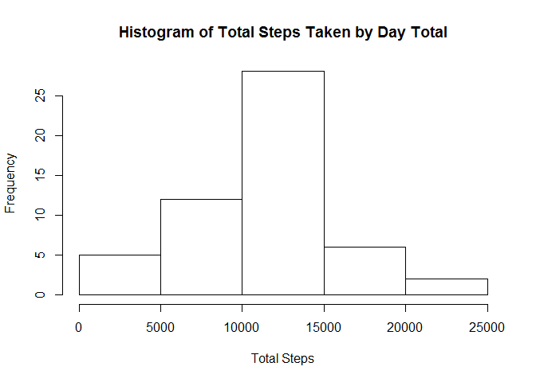

# Reproducible Research: Peer Assessment 1


## Loading and preprocessing the data

```r
    setwd('C:/Users/kfollmer/Documents/R/Data Science Course/Reproducible Research/RepData_PeerAssessment1')
    data <- read.csv('activity.csv')
    dat_clean <- data[!is.na(data$steps),]
```


## What is mean total number of steps taken per day?
First, I calculate the sum of steps by the different dates. Then I plot that information on a histogram. Lastly, I calculated some summary statistics

```r
    d1 <- aggregate(dat_clean$steps,list(date=dat_clean$date),sum)
    as.numeric(d1$x)
```

```
##  [1]   126 11352 12116 13294 15420 11015 12811  9900 10304 17382 12426
## [12] 15098 10139 15084 13452 10056 11829 10395  8821 13460  8918  8355
## [23]  2492  6778 10119 11458  5018  9819 15414 10600 10571 10439  8334
## [34] 12883  3219 12608 10765  7336    41  5441 14339 15110  8841  4472
## [45] 12787 20427 21194 14478 11834 11162 13646 10183  7047
```

```r
    hist(d1$x, xlab = "Total Steps", main = "Histogram of Total Steps Taken by Day Total")
```

 

```r
    mean(d1$x)
```

```
## [1] 10766.19
```

```r
    median(d1$x)
```

```
## [1] 10765
```

## What is the average daily activity pattern?

```r
    d3 <- cbind(dat_clean$interval,dat_clean$steps)
    d4 <- aggregate(d3, list(Interval = d3[,1]),mean)
    d4 <- d4[,2:3]
    colnames(d4) <- c("interval", "steps")
    plot(d4$interval, d4$steps,xlab = "Interval",ylab = "Mean of Steps",type = 'l')
```

 

```r
    maxInterval <- d4[d4$steps==max(d4$steps),]
    maxInterval
```

```
##     interval    steps
## 104      835 206.1698
```
## Imputing missing values
How many observations are missing steps values?

```r
    nrow(data[is.na(data$steps),])
```

```
## [1] 2304
```
Add the mean value for that interval to account for the missing intervals

```r
    edit <- data[is.na(data$steps),2:3]
    editUpdate <- merge(edit,d4,by="interval")
    library(data.table)
    editUpdate <- data.table(editUpdate)
    setcolorder(editUpdate,c("steps","date","interval"))
    proxyDat <- rbind(dat_clean,editUpdate, fill=TRUE)
```

## Are there differences in activity patterns between weekdays and weekends?
First, we set up the data

```r
d5 <- cbind(proxyDat,dow = weekdays(as.Date(proxyDat$date)))
dow <- c("Monday","Tuesday","Wednesday","Thursday","Friday","Saturday","Sunday")
label <- c("weekday","weekday","weekday","weekday","weekday","weekend","weekend")
lookup <- cbind(dow,label)
d6 <- merge(d5, lookup, by="dow")
```
Then, I plot using lattice

```r
library(lattice)
d6 <- data.frame(d6)
d6a <- aggregate(steps~interval+label,d6,mean)
xyplot(d6a$steps~d6a$interval|d6a$label, par = c(2,1),type = 'l', xlab = "Interval", ylab = "Average Steps")
```

 
